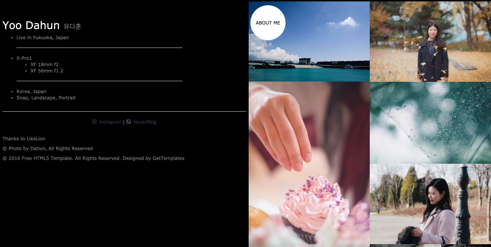
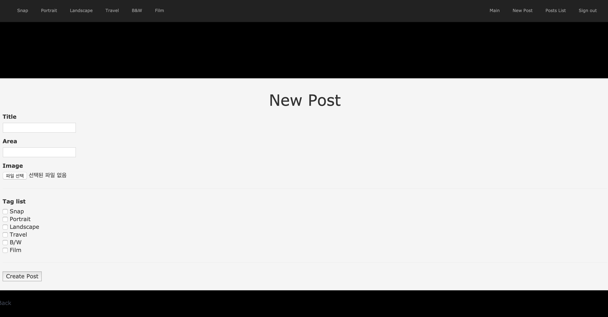
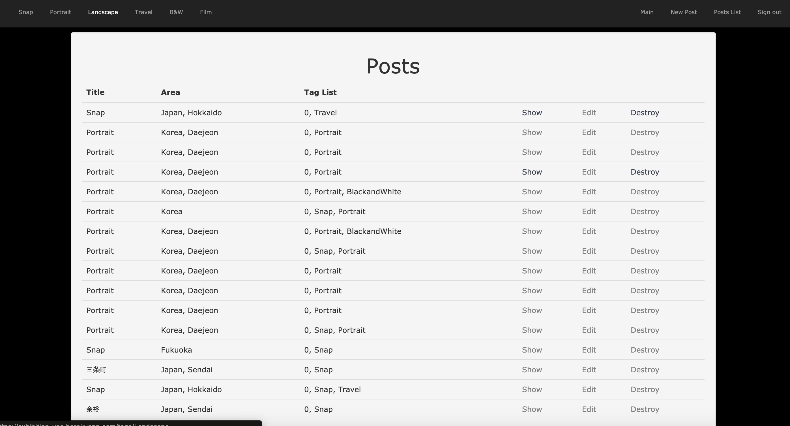
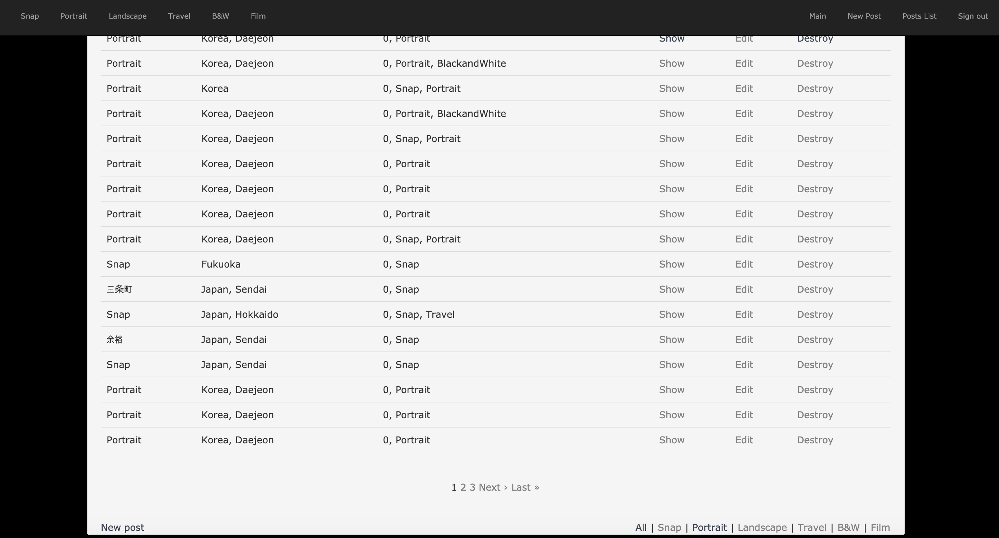

# Exhibition

This is my own work that Photo gallery. I use Design Template for photography and support auto layout

https://exhibition-yoo.herokuapp.com/

## Personal BLOG

### Personal Work

- 開発サークルで学んだ知識を生かして、個人プロジェクトとして作成

- デザインはテンプレートを使用

  > 趣味が写真であり、Instagramの他に、Portfolioとして使うため作成しました。
  >
  > S3をFree tierで使用するためか、写真が多くなると接続とRefreshに時間がかかります。
  
  
  
  写真のSlide showで感想可能な機能
  
  
  
  プロフィールのためのサイドバー実装
  
  
  
  イメージにタグをつけてアップロードできる簡単な掲示板実装（CRUD）
  
  
  
  ポスト管理機能
  
  
  
  ポスト管理のためのページング機能

#### 使用した技術

- Ruby on Rails
- HTML
- JavaScript
- AWS S3, EC2
- C9
- Heroku
- Git, Bitbucket

